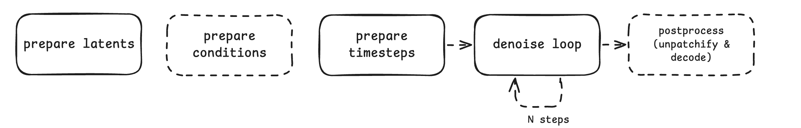

## Purpose and functions

**Purpose:** This design is for a diffusion engine core to execute a diffusion pipeline using a DiT model as noise predictor.

The first version focus on connecting the DiT model in diffusers (or transformers QwenOmni DiT model) with the AR model in vllm. The design philosophy is to make the adaptation as light-weight as possible, specifically to: 
1. re-use the existing DiT models and diffusion pipelines in diffusers/transformers if possible, 
2. make sure it's compatible with the model management and execution framework of vllm,
3. make it easy to extend to other models.

**Function definition**: Given guidance signals such as text prompt embedding or reference image embedding, the diffusion model executor execute a diffusion pipeline (text-to-image, token-to-audio, etc) which typically use a DiT model as noise predictor and performs the multi-step denoising process to generate the denoised latents. The denoising timesteps are controlled by the diffusion scheduler.

**Limited Scope:** 
1. AR-based multimodal generation model is not considered currently. We assume the vllm model executor is responsible for all AR modules so as to take advantage of core optimzation like KV cache and complex parallelism. For QwenOmni, this model executor considers the Token2Wave Model only. For QwenImage, it considers the MM-DiT model only.
2. Condition encoding and vae decoding are expected to run out of diffusion model executor for better computational disaggregation and resouce scheduling. Such as qwen2.5vl text encoder in QwenOmni, QwenImageVAE in QwenImage, etc. 


The core components of the diffusion models that we mainly consider are as follows: 

| Model                | Diffusion Pipeline         | Scheduler                        | Mulimodal/Text Encoder   | DiT arch.                | Latent Decoder         |
|----------------------|---------------------------|-----------------------------------|-------------------------------|--------------------------------------|------------------------|
| QwenImage            | QwenImagePipeline         | FlowMatchEulerDiscreteScheduler   | text: Qwen2.5-VL; image: QwenImageVAE    | QwenImageTransformer2DModel          | QwenImageVAE           |
| Qwen2_5Omni   | Token2Wav Sampling (custom) | RungeKutta4ODESolver (custom) | MM: Thinker + Talker AR models | Qwen2_5OmniToken2WavDiTModel         | Qwen2_5OmniToken2WavBigVGANModel |


## Model loading and management

### Model Initialization and Registration
- vllm model initialization

Let review vllm v1 model initialization stack at first as we want to make it compatible with vllm engine core design.

```text
LLM.__init__()
↓
v1.LLMEngine.__init__()
↓
v1.Worker.__init__()
↓
GPUModelRunner.__init__()
↓
GPUModelRunner.load_model()
↓
get_model()
↓
DefaultModelLoader.load_model()
↓
initialize_model()
↓
get_model_architecture()
↓
Qwen2AudioForConditionalGeneration.__init__()
```

The `get_model` function in model executor are for:
1. get_model_architecture() - gets the model architecture from the registered models
2. initialize_model() - creates the model instance
3. load_weights() - loads the weights
4. process_weights_after_loading() - post-processing


```text
get_model()
  → loader.load_model()
    → initialize_model()
      → model_class, _ = get_model_architecture(model_config)
        → model_config.registry.resolve_model_cls() → point to ModelRegistry
      → model_class()
    → load_weights()
```

Here `model_config.registry` points to `vllm.model_executor.models.ModelRegistry`, as model_config is a ModelConfig object defined in vllm.config as follows:

```python
# vllm/vllm/config/__init__.py
import vllm.model_executor.models as me_models

class ModelConfig:
    @property
    def registry(self):
        return me_models.ModelRegistry  # ← This is the key!
```

vllm manages the registered models including QwenOmni via `ModelRegistry`: 

```python
# vllm/vllm/model_executor/models/registry.py 
_MULTIMODAL_MODELS = {
    "Qwen2_5OmniModel": ("qwen2_5_omni_thinker", "Qwen2_5OmniThinkerForConditionalGeneration"),  # noqa: E501
    "Qwen2_5OmniForConditionalGeneration": ("qwen2_5_omni_thinker", "Qwen2_5OmniThinkerForConditionalGeneration"),  # noqa: E501
    ...
}

ModelRegistry = _ModelRegistry({
    model_arch:
    _LazyRegisteredModel(
        module_name=f"vllm.model_executor.models.{mod_relname}",
        class_name=cls_name,
    )
    for model_arch, (mod_relname, cls_name) in _VLLM_MODELS.items()
})

```

Note that vllm model registry maps Qwen2_5OmniModel to `Qwen2_5OmniThinkerForConditionalGeneration`. But in vllm-omni, Qwen2_5OmniModel should be mapped to `QwenOmniDiTForDiffusionGeneration`, which is the DiT model and pipeline wrapper.


- vllm-omni model initialization

Based on the above analysis, here are the necessary adaptations to re-use vllm model initialization stack for vllm-omni.
1. create a new ModelRegistry for vllm-omni, `ModelRegistryOmni`, to register diffusion models seperately from vllm.
2. points `ModelConfig.registry` to `ModelRegistryOmni` in `vllm_omni/config/__init__.py` 
3. re-write the `get_models` function to use `ModelConfig` in vllm-omni 


### Weight Loading

We will re-use the the weight loading function in vllm, since Diffusion models use the same weight formats as text generation models, e.g. safetensors, pt, etc

Specifically,  for weight name mapping between hf and vllm, we will add a weight mapper in the model class, such as:

```
hf_to_vllm_mapper = WeightsMapper(
    orig_to_new_prefix={
        "model.": "token2wav.model.",
    })
```

Then we can apply `AutoWeightLoader` to load weights into the initialized model by the `load_weights` function of the model class.  

```python
def load_weights(self, weights: Iterable[tuple[str, torch.Tensor]]) -> set[str]:
    """Load weights with proper mapping for DiT model"""
    loader = AutoWeightsLoader(self.dit_model)
    return loader.load_weights(weights, mapper=self.hf_to_vllm_mapper)
```
   
### Model Config from Diffusers to vllm-omni 

Firstly, let us review the core logic of model config parsing logis in vllm:

```
EngineArgs.create_model_config()                                           
    - Creates ModelConfig(model="Qwen/Qwen2.5-7B", ...)                       
    - ModelConfig.__post_init__() is automatically called

ModelConfig.__post_init__()                                                
    - Calls get_config(model_path, trust_remote_code, ...)                 
    - Stores result in self.hf_config
```

The `get_config` function is the core API to parse model config from Hunggingface.

```python
# vllm/transformers_utils/config.py:348
def get_config(model, trust_remote_code, ...):
    # Format detection
    if file_or_path_exists(model, "config.json"):
        config_format = ConfigFormat.HF

    # Load config dict
    config_dict, _ = PretrainedConfig.get_config_dict(model, ...)
    model_type = config_dict.get("model_type")  # "qwen2"

    # Choose config class
    if model_type in _CONFIG_REGISTRY:
        config = _CONFIG_REGISTRY[model_type].from_pretrained(...)
    else:
        config = AutoConfig.from_pretrained(...)
```

Secondly, let's analyze the config format of QwenOmni and QwenImage.

- QwenOmni from Transformers (Single config file)

```json
{
  "architectures": ["Qwen2_5OmniModel"],
  "token2wav_config": {
    "dit_config": { ... },
    "bigvgan_config": { ... }
  }
}
```

- QwenImage from Transfomers (Multiple config files)

```
Qwen-Image/
├── model_index.json           # QwenImagePipeline overall config
├── scheduler/sheduler_config.json    # FlowMatchEulerDiscreteScheduler 
├── transformer/config.json    # QwenImageTransformer2DModel
├── vae/config.json            # AutoencoderKLQwenImage
└── text_encoder/config.json   # Qwen2_5_VLForConditionalGeneration
```

```
# Qwen-Image/transformer/config.json
{
  "_class_name": "QwenImageTransformer2DModel",
  "_diffusers_version": "0.34.0.dev0",
  "attention_head_dim": 128,
  ...
}
```

Note that the config file organization and format in diffsers are different from transfomers, we can make the following changes.
1. re-write the `get_config` function in `vllm_omni/transformers_utils/config.py`, to detect whether the model is from diffusers or transformers, and add the method to handle diffusers format.
2. inherit ModelConfig from vllm and override `__post_init__()` so that it calls the new `get_config` function from vllm-omni.


## Inference Execution

The multi-step diffusion pipeline typically contains the following core steps: 

1. **prepare latents**: prepare the latent noise. For qwenimage, it's a tensor of shape (bs, img_seq_len, num_channel). For qwen-omni, it's a tensor of shape (1, 30000, mel_dim)
    - diffusers: `src/diffusers/pipelines/qwenimage/pipeline_qwenimage.py:L626`
    - transformers: `src/transformers/models/qwen2_5_omni/modular_qwen2_5_omni.py:L3878`
2. **prepare conditions**: get the conditions, such as text prompt embeding, reference image embedding, speaker embedding. Expect to parse from input args.
    - diffusers: `src/diffusers/pipelines/qwenimage/pipeline_qwenimage.py:L606` 
    - transformers: `src/transformers/models/qwen2_5_omni/modular_qwen2_5_omni.py:L3882`
3. **prepare timesteps**: prepare the timesteps for diffusion noise scheduling
    - diffusers: `src/diffusers/pipelines/qwenimage/pipeline_qwenimage.py:L648`
    - transformers: `src/transformers/models/qwen2_5_omni/modular_qwen2_5_omni.py:L3912`
4. **denoise loop**: iteratively update the latent based on the timestep and model predictive output, optionally use CFG (condition-free guidance) which requires to double the batch size
    - diffusers: `src/diffusers/pipelines/qwenimage/pipeline_qwenimage.py:L682-745`
    - transformers: `src/transformers/models/qwen2_5_omni/modular_qwen2_5_omni.py:L3756-L3767`
5. **postprocess**: unpatchify and decode the denoised latents to the original modality such as image/audio/video. The decoding model is typically a VAE (VAE for QwenImage, GAN for QwenOmni)

<p align="center">
  
  <br>
  <em>Core steps in diffusion pipeline</em>
</p>


In our AR-DiT disaggregation framework, Step 3 (prepare conditions) and Step 5 (postprocess) should excluded for vllm-omni model executor. 

The key question: **Can we still re-use the existing diffusers pipeline in the diffusion model executor of our AR-DiT disaggregation framework?**

Yes! Here are the necessary adaptations to make it work:
- For text to image tasks, the conditions in step 3 are text prompts.we can parse the text prompt embedding via the `prompt_embeds` argument in diffusers pipeline (QwenImagePipeline) and leave the `prompt` argument None. Similarly, we can set the `output_type` argument to "latent" to skip step 5
- For image to image tasks, the conditions in step 3 contains both text prompts and reference image. Different from T2I task, we need to submit a PR to diffusers to add a `image_embeds` argument to parse reference image embedding.


## API specifications

### Model Class Initialization

The model class initialization code should be like:

```python
# vllm_omni/model_executor/models/xxx_dit.py

from diffusers import QwenImageTransformer2DModel
from diffusers import QwenImagePipeline, QwenImageEditPipeline

class XXXDiTForDiffusionGeneration(nn.Module):
    def __init__(self, vllm_config: VllmConfig, prefix: str = ""):
        super().__init__()
        # 1. Extract the dit config from the main model config
        self.config = vllm_config.model_config
        self.prefix = prefix
        self.dit_config = self._extract_dit_config()
        
        # 2. Initialize the DiT model using transformers/diffusers implementation
        self.dit_model = XXXDiTModel(self.dit_config)

        # 3. setup diffusion pipeline (optional for QwenOmni)
        self._setup_for_diffusion_pipeline()

    def _setup_for_diffusion_pipeline(self):
        """prepare all necessary components for pipeline running, such as timestep scheduler.
        
        Optional for QwenOmni
        """
        from diffusers import FlowMatchEulerDiscreteScheduler
        # 1) create diffusion scheduler
        self.scheduler_config = self.model_config.scheduler_config
        self.scheduler = FlowMatchEulerDiscreteScheduler.from_config(self.scheduler_config)
        # 2) create diffusion pipeline
        self.pipeline_name = self.config._class_name
        self.pipeline = QwenImagePipeline(
            scheduler = self.scheduler,
            vae=None,
            text_encoder=None,
            tokenizer=None,
            transformer=self.dit_model,
        )
        # 3) enable and re-use optimization from diffusers pipeline
        self.pipeline.enable_xformers_memory_efficient_attention()

```

- The `__init__` args are fully compatible with vllm for model initialization.
- In the `__init__()` implementation, different from vllm, we need to setup the diffusion pipeline so as to re-use the diffusion pipeline from diffusers.
- For different pieplines (QwenImagePipeline, QwenImageEditPipeline) using the same DiT architecture, each pipeline has a independent model class.
- A new pipeline using the same DiT model can inherit the previous pipeline and just override the `_setup_for_diffusion_pipeline()` method to the different components of the pipeline. (And override the `sample()` method which will be discussed in the next section)

### Model Class Execution

We will add a `sample()` method to serve as the main entry point for diffusion pipeline running. 

```python
# vllm_omni/model_executor/models/xxx_dit.py
class XXXDiTForDiffusionGeneration(nn.Module):
    @torch.no_grad()
    def sample(self,
        prompt_embeds: torch.Tensor,
        prompt_embeds_mask: Optional[torch.Tensor] = None,
        true_cfg_scale: float = 4.0,
        height: Optional[int] = None,
        width: Optional[int] = None,
        num_inference_steps: int = 50,
        sigmas: Optional[List[float]] = None,
        guidance_scale: Optional[float] = None,
        num_images_per_prompt: int = 1,
        generator: Optional[Union[torch.Generator, List[torch.Generator]]] = None,
        latents: Optional[torch.Tensor] = None,
        negative_prompt_embeds: Optional[torch.Tensor] = None,
        negative_prompt_embeds_mask: Optional[torch.Tensor] = None,
        attention_kwargs: Optional[Dict[str, Any]] = None,
        max_sequence_length: int = 512,
    ):

        latents = self.pipeline(
            prompt_embeds=prompt_embeds,
            num_inference_steps=num_inference_steps,
            return_type='latents',
            ...
        )
```

The args of `sample()` inherit from diffusers pipeline with the following changes:
1. require `prompt_embeds`, which is generated from Text Encoder from vllm engine core
2. remove `return_type`, which is forced to 'latents'. the return latents will be processed by vae decoding in AsynLLM outut processor
3. remove unused args: `callback_on_step_end`

, such that we can re-use the optimized diffusers pipeline.

Since the args of `sample()` are different for different pipelines of the same DiT models, the developer should inherit previous pipeline (e.g. QwenImage T2I) and override the `sample()` method when adding a new pipeline (e.g. QwenImageEdit).


### Model Registration and Management

#### Model Registration

As discussed in [model-initialization-and-registration](#model-initialization-and-registration), we design the registration APIs as follows.


```python
# vllm_omni/model_executor/models/registry.py

# Define diffusion models supported by vLLM-omni
_DIFFUSION_MODELS = {
    # QwenOmni models (transformers-style)
    # Main architecture from HF config - this conflicts with vLLM's mapping
    "Qwen2_5OmniModel": ("qwen2_5_omni", "QwenOmniDiTForDiffusionGeneration"),

    # QwenImage models (diffusers-style)
    "QwenImageTransformer2DModel": ("qwen_image", "QwenImageDiTForDiffusionGeneration"),
    "QwenImagePipeline": ("qwen_image", "QwenImageDiTForDiffusionGeneration"),
}

# Create separate ModelRegistryOmni for diffusion models (completely independent from vLLM)
ModelRegistryOmni = _ModelRegistry({
    model_arch: _LazyRegisteredModel(
        module_name=f"vllm_omni.model_executor.models.{mod_relname}",
        class_name=cls_name,
    )
    for model_arch, (mod_relname, cls_name) in _DIFFUSION_MODELS.items()
})

```

The developer needs to register the diffusion model in `_DIFFUSION_MODELS` dict. The format is (model_arch, (mod_relname, cls_name)):

* model_arch: the model architecture name defined in HuggingFace config file.
* mod_relname: model file name in `model_executor/models`
* cls_name: model class name in vllm


#### Model Configuration
> Adaptations for diffusers model config parsing. Model developers can ignore this section.

As discussed in [model-initialization-and-registration](#model-initialization-and-registration), we need to modify the `get_config()` method to load diffusers model config and override the `ModelConfig` class to use the registered diffusion model.

- `get_config`

```python
# vllm_omni/model_executor/model_loader/__init__.py
def get_config(
    model: Union[str, Path],
    trust_remote_code: bool,
    revision: Optional[str] = None,
    code_revision: Optional[str] = None,
    config_format: str = "auto",
    hf_overrides_kw: Optional[dict[str, Any]] = None,
    hf_overrides_fn: Optional[Callable[[PretrainedConfig],
                                       PretrainedConfig]] = None,
    **kwargs,
) -> PretrainedConfig:
   
    # First check if this is a diffusers format model
    if _is_diffusers_format(model):
        print(f"Detected diffusers format model: {model}")
        try:
            return _load_diffusers_config(
                model=model,
                trust_remote_code=trust_remote_code,
                revision=revision,
                code_revision=code_revision,
                hf_overrides_kw=hf_overrides_kw,
                hf_overrides_fn=hf_overrides_fn,
                **kwargs,
            )
        except Exception as e:
            print(f"Failed to load diffusers config for {model}: {e}")
            print("Falling back to HuggingFace transformers format")
    
    # Fall back to vLLM's original get_config for regular transformers models
    # Import here to avoid circular imports
    try:
        from vllm.transformers_utils.config import get_config as vllm_get_config
        return vllm_get_config(
            model=model,
            trust_remote_code=trust_remote_code,
            revision=revision,
            code_revision=code_revision,
            config_format=config_format,
            hf_overrides_kw=hf_overrides_kw,
            hf_overrides_fn=hf_overrides_fn,
            **kwargs,
        )
    except ImportError:
        # If vLLM is not available, create a mock config
        print("vLLM not available, creating mock config")
        from transformers import PretrainedConfig
        return PretrainedConfig()
```
It extends `get_config` that supports both HuggingFace transformers and diffusers formats. This function first checks if the model is in diffusers format (by looking for
model_index.json), and if so, loads the appropriate diffusers config.


- `ModelConfig`

```python
# vllm_omni/config/__init__.py

# Import everything from vLLM's config first
from vllm.config import *

# Import ModelConfig specifically and alias it for clarity
from vllm.config import ModelConfig as VllmModelConfig

# Import our extended config utilities
import vllm_omni.transformers_utils.config as config_utils
import vllm_omni.model_executor.models as me_models

class ModelConfig(VllmModelConfig):
   
    def __post_init__(self):
        """Override __post_init__ to use our extended get_config function."""
        # Call parent's __post_init__ but temporarily replace get_config
        import vllm.transformers_utils.config as vllm_config_utils
        
        # Save original get_config
        original_get_config = vllm_config_utils.get_config
        
        # Replace with our extended get_config
        vllm_config_utils.get_config = config_utils.get_config
        
        try:
            # Call parent's __post_init__ which will now use our get_config
            super().__post_init__()
        finally:
            # Restore original get_config
            vllm_config_utils.get_config = original_get_config
    
    @property
    def registry(self):
        """
        Return our ModelRegistryOmni for diffusion models.
        """
        return me_models.ModelRegistryOmni

```

It extend vllm `ModelConfig` to:
1. overrides __post_init__ to use our extended get_config function for diffusers config loading
2. overrides the registry property to use our registered diffusion model indexed in `ModelRegistryOmni`


## Reference
- https://docs.vllm.ai/en/latest/design/arch_overview.html#model-runner
- add model https://docs.vllm.ai/en/stable/contributing/model/basic.html
